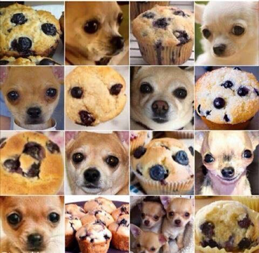
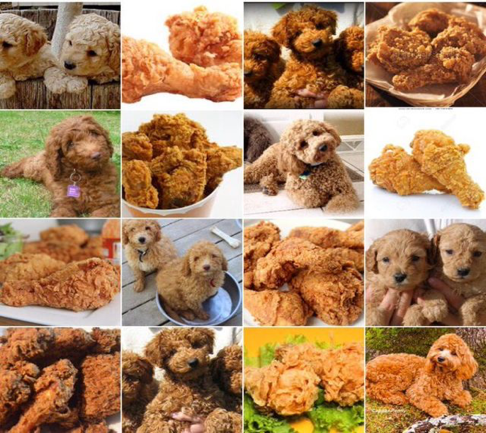

# Project 3: Dogs, Fried Chicken or Blueberry Muffins?



### [Project Description](https://github.com/TZstatsADS/ADS_Teaching/blob/master/Projects_StarterCodes/Project3_PoodleKFC/doc/project3_desc.md)

In this project, we will carry out model evaluation and selection for predictive analytics on image data. As data scientists, we often need to evaluate different modeling/analysis strategies and decide what is the best. Such decisions need to be supported by sound evidence in the form of model assessment, validation and comparison. In addition, we also need to communicate our decision and supporting evidence clearly and convincingly in an accessible fashion.

Term: Spring 2018

+ Team #9
+ Team members
	+ Fan Yang
	+ Jingyi Wang
	+ Xueyao Li
	+ Yiran Jiang

+ **Project summary**: In this project, we created a classification engine for images of dogs versus fried chicken versus blueberry muffins. 
	
+ **Contribution statement**: ([Team #9 contribution statement](doc/a_note_on_contributions.md)) 
All team members contributed equally in all stages of this project. All team members approve our work presented in this GitHub repository including this contributions statement. 

Following [suggestions](http://nicercode.github.io/blog/2013-04-05-projects/) by [RICH FITZJOHN](http://nicercode.github.io/about/#Team) (@richfitz). This folder is orgarnized as follows.

```
proj/
├── lib/
├── data/
├── doc/
├── figs/
└── output/
```

Please see each subfolder for a README file.
