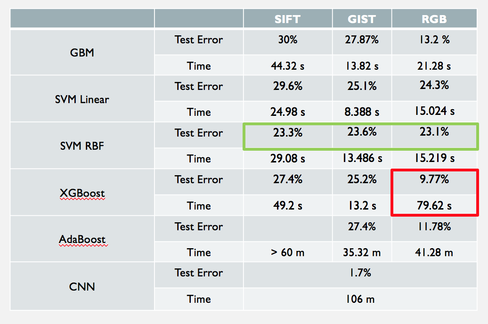

# Dogs, Fried Chicken or Blueberry Muffins?


Fried Chicken or Dogs?|  Blueberry Muffins or Dogs?  
:-------------------------:|:-------------------------:
  |   


+ Team members
	+ Fan Yang
	+ Jingyi Wang
	+ Xueyao Li
	+ Yiran Jiang

## Introduction 
The goal is this project is to classify 3000 images of dogs, fried chicken and blueberry muffins and carry out model evaluation and selection for predictive analytics on image data.

`main.Rmd`: combine data cleaning, training, parameter tuning, and evaluation togeher. 

## Method
+ **Baseline model:** Gradient Boosting Machine(GBM) with decision stumps on SIFT features. 
+ **Feature extraction methods:** SIFT, RGB and GIST. 
+ **Advanced classification modelS:** SVM(Linear and RBF kernel), XGBoost, AdaBoost and Convolutional Neural Network(CNN).
+ **Final Model:** XGBoost with RGB feature.

## Results

After model evaluation and comparison, XGBoost achieves the best performance among all classification methods. After comparing different features on XGBoost, we select the RGB as the final feature. The final model reduced the test error to 9.77% with a running time 48.467s.


**Baseline vs advanced models on running time and test error.**


**Features performance on XGBoost model**


## Reference 
+ **Contribution statement**: ([Team 9 contribution statement](doc/a_note_on_contributions.md)) 
+ Following [suggestions](http://nicercode.github.io/blog/2013-04-05-projects/) by [RICH FITZJOHN](http://nicercode.github.io/about/#Team) (@richfitz). This folder is orgarnized as follows.
	
	```
	proj/
	├── lib/
	├── data/
	├── doc/
	├── figs/
	└── output/
	```
	Please see each subfolder for a README file.
