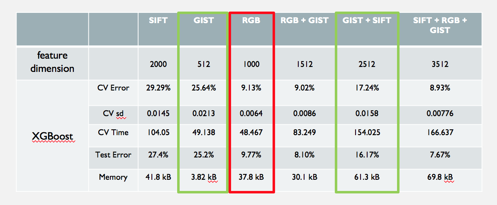

# Project 3: Dogs, Fried Chicken or Blueberry Muffins?


### [Project Description](https://github.com/TZstatsADS/ADS_Teaching/blob/master/Projects_StarterCodes/Project3_PoodleKFC/doc/project3_desc.md)

In this project, we will carry out model evaluation and selection for predictive analytics on image data. 

Term: Spring 2018

+ Team 9
+ Team members
	+ Fan Yang
	+ Jingyi Wang
	+ Xueyao Li
	+ Yiran Jiang

+ **Project summary**: 

In this project, we created a classification engine for images of dogs versus fried chicken versus blueberry muffins. The baseline model used GBM with decision stumps on SIFT features. For feature extraction, besides the SIFT, we also tried RGB and GIST. For advanced model, we considered SVM(Linear and RBF kernel), XGBoost, AdaBoost and Convolution Neural Network(CNN).

After model evaluation and comparison, XGBoost achieved the best performance. Then we tuned RGB hyper parameters and considered the combination of features. Comparing different features on XGBoost, we chose the RGB+Gist. The final model reduced the test error to 8.10% with a running time 83.249s.

Comparison of baseline and advanced models:


Comparison of different features on XGBoost:


+ **Contribution statement**: ([Team 9 contribution statement](doc/a_note_on_contributions.md)) 
All team members contributed equally in all stages of this project. All team members approve our work presented in this GitHub repository including this contributions statement. 

Following [suggestions](http://nicercode.github.io/blog/2013-04-05-projects/) by [RICH FITZJOHN](http://nicercode.github.io/about/#Team) (@richfitz). This folder is orgarnized as follows.

```
proj/
├── lib/
├── data/
├── doc/
├── figs/
└── output/
```

Please see each subfolder for a README file.
